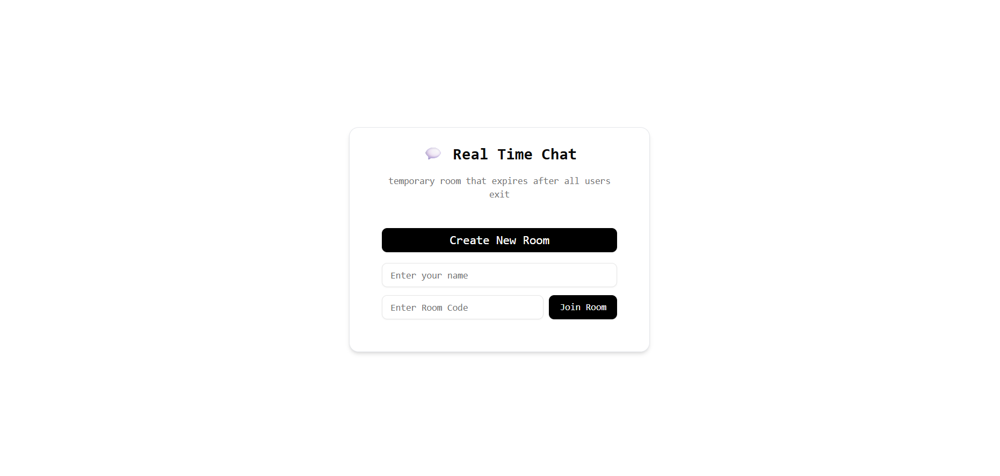
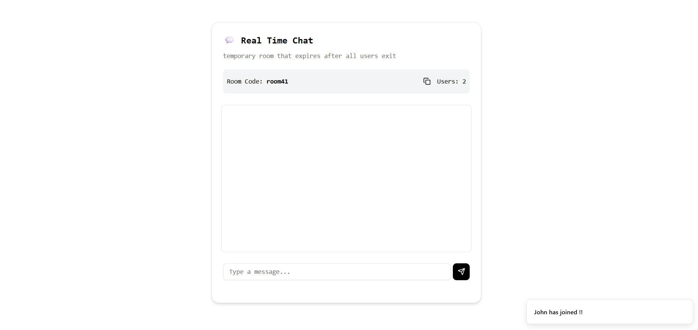
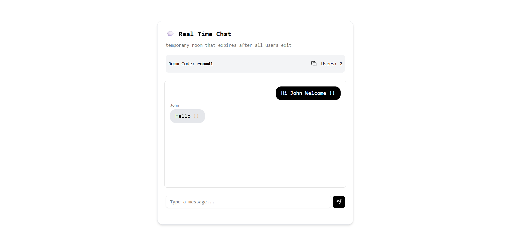

# WebSocket-ChatApp-Frontend

A real-time chat application built using **WebSockets** for seamless communication between clients. This project demonstrates how to create a live chat feature in a web application using WebSocket technology using the ws websocket library.

  

## Features

- Real-time messaging with WebSocket connection
- Minimalistic and responsive design
- Simple UI for chatting with friends or colleagues

## What I Learned

- How to establish a WebSocket connection in a React app
- Handling real-time data flow between clients using WebSocket 
- Learnt the logic of making rooms.
- Building a frontend with **React** and **Vite** for fast development

## Author

- [VineshRajkumar](https://github.com/VineshRajkumar)
